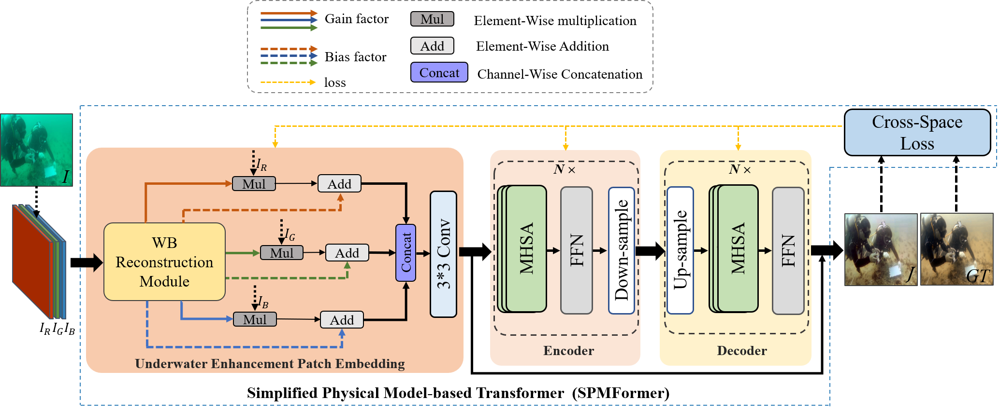

# SPMFormer
A novel physical model-based transformer framework for underwater image enhancement.

This repository includes code for the following paper: 

🚀 **SPMFormer: Simplified Physical Model-based Transformer with cross-space loss for Underwater Image Enhancement**  
**✅ Accepted in Knowledge-Based Systems (KBS)**  
**Authors:** Zhuohao Li & et al.   
**Paper:** [SPMFormer](https://doi.org/10.1016/j.knosys.2025.113694)
>***Abstract:***  
*The absorption and scattering of light by water lead to the degradation of underwater images, resulting in image color distortion and blurred details. Recently, Transformer models have been extended to underwater image enhancement (UIE) and seem to have achieved promising results. However, most existing Transformer-based UIE methods overlook the benefits of physical models with underwater characteristics for scene understanding and pose significant challenges for resource-constrained underwater devices (e.g., autonomous underwater vehicles) due to the added computational costs of redesigned attention mechanisms. To bridge this gap, a simple yet novel Transformer framework based on Simplified underwater Physical Models (SPMFormer) is proposed. Specifically, by introducing physical models, a novel Underwater Enhancement Patch Embedding (UEPE) is designed to preliminarily restore underwater images instead of redesigning attention mechanisms. Secondly, a novel cross-space loss function that incorporates channel-level ratio information from both RGB and LAB color spaces with the frequency domain of the image is proposed, further enhancing image details. Thirdly, a carefully designed lightweight version of SPMFormer has been developed, achieving a remarkable reduction of up to 450× lower network parameters and computations, which is critical for underwater devices. Finally, extensive experiments on three benchmark datasets show that our SPMFormer efficiently achieves the best performance compared to other transformer-based methods in qualitative and quantitative metrics. The usability and generalizability of SPMFormer have been demonstrated by our cross-dataset and real-world ocean experiment results.* 
<p align="middle">
  
</p>
<p align="middle">
  
</p>

# Training Environment
We train and test the code on PyTorch 1.10.2 + CUDA 11.3 + cuDNN 8.2.0.

1. Create a new conda environment
```
conda create -n SPMFormer python=3.7
conda activate SPMFormer
```

2. Install dependencies
```
conda install pytorch=1.10.2 torchvision torchaudio cudatoolkit=11.3 -c pytorch
pip install -r requirements.txt
```

# Instructions
Please execute the following instructions to configure the parameters for running the program:

1. Model Training
python train.py --model (model name) --dataset (dataset name) --exp (exp name)

2. Model Testing
python test.py --model (model name) --dataset (dataset name) --exp (exp name)

# Citation
👉 If our work is helpful for your research, please consider citing:
```
@article{LI2025113694,
title = {SPMFormer: Simplified Physical Model-based transformer with cross-space loss for underwater image enhancement},
journal = {Knowledge-Based Systems},
pages = {113694},
year = {2025},
issn = {0950-7051},
doi = {https://doi.org/10.1016/j.knosys.2025.113694},
url = {https://www.sciencedirect.com/science/article/pii/S0950705125007403},
author = {Zhuohao Li and Qichao Chen and Jianming Miao}
}
```
